# Nexus RAG MCP Server 🧠

<div align="center">


**The "Second Brain" for your AI Assistant.**

[Features](#key-features) • [Installation](#installation) • [Usage](#usage) • [Architecture](#system-architecture) • [Tools](#available-mcp-tools)

</div>

---

## 🚀 What is Nexus?

**Nexus** is a local, privacy-focused **Model Context Protocol (MCP)** server that gives your AI agents (like Claude Desktop, Cursor, etc.) **Long-Term Memory** and **RAG (Retrieval-Augmented Generation)** capabilities on your local files.

It solves the "amnesia" problem of LLMs by allowing them to:
1.  **Search** your local documents/notes intelligently.
2.  **Remember** facts, preferences, and project context between conversations.
3.  **Learn** from your interactions and adapt over time.

---

## ✨ Key Features

### 🔍 Advanced RAG Engine
*   **Hybrid Search**: Combines **Semantic Search** (Embeddings) with **Keyword Search** (BM25) for high recall.
*   **Smart Reranking**: Uses **Cross-Encoders** to re-score results, ensuring the most relevant info is always top-1.
*   **Auto-Ingestion**: Watches your folders and automatically indexes changes in real-time.
*   **Privacy First**: All data runs locally. Embeddings and vector storage (Qdrant) are embedded.

### 🧠 AI Memory Layer
*   **Project Context**: Stores architecture decisions, tech stacks, and TODOs for your projects.
*   **User Preferences**: Remembers your coding style (e.g., "User prefers Pytest over Unittest").
*   **Fact Store**: Persistent storage for important details that shouldn't be lost.
*   **Fact Store**: Persistent storage for important details that shouldn't be lost.

### 🌐 Multi-MCP Orchestration
**This is the "Killer Feature".** Since Nexus is an MCP server, it can work alongside **GitHub MCP**, **Notion MCP**, **Slack MCP**, etc. in your client (Claude/Cursor).

*   **Ingest Anything**: Ask Claude to "Read the README from the GitHub MCP and save it to Nexus".
*   **Centralized Knowledge**: Pull docs from Notion, code from GitHub, and chats from Slack into ONE searchable brain.
*   **Client-Side Integration**: No need for Nexus to have API keys—it relies on your Client to fetch data and feed it to Nexus.

---

## 🏗️ System Architecture

Nexus uses a dual-layer architecture separating **Document Retrieval (RAG)** from **Cognitive Memory**.

```mermaid
graph TB
    %% --- Styles ---
    classDef client fill:#f9f9f9,stroke:#333,stroke-width:2px;
    classDef orchestration fill:#e1f5fe,stroke:#0277bd,stroke-width:2px,stroke-dasharray: 5 5;
    classDef nexus fill:#fff3e0,stroke:#ef6c00,stroke-width:4px;
    classDef memory fill:#e8f5e9,stroke:#2e7d32,stroke-width:2px;
    classDef rag fill:#f3e5f5,stroke:#7b1fa2,stroke-width:2px;
    classDef storage fill:#eceff1,stroke:#455a64,stroke-width:2px;

    %% --- External World ---
    %% --- External World ---
    Client(["🤖 AI Assistant<br/>Claude / Cursor / IDE"])
    class Client client

    subgraph Orchestration ["🌐 Orchestration Layer"]
        Github[GitHub MCP]
        Notion[Notion MCP]
        Other[Other MCPs]
    end
    class Github,Notion,Other orchestration

    %% --- Nexus Core ---
    subgraph Nexus ["🔥 Nexus Server (Core)"]
        API[🔌 MCP Interface Protocol]
        class API nexus

        subgraph Cognitive ["🧠 Cognitive Engine"]
            MemManager[Memory Manager]
            Context[Project Context]
            Preferences[User Preferences]
            class MemManager,Context,Preferences memory
            MemManager --> Context
            MemManager --> Preferences
        end

        subgraph Retrieval ["🔍 Retrieval Engine"]
            Hybrid["Hybrid Search<br/>(Dense + Sparse)"]
            Reranker["Cross-Encoder<br/>Reranker"]
            class Hybrid,Reranker rag
            Hybrid --> Reranker
        end
        
        subgraph DataOps ["⚡ Data Operations"]
            Ingest[Ingestion Pipeline]
            Watcher[File Watcher]
            class Ingest,Watcher rag
        end
    end

    %% --- Storage Layer ---
    subgraph Storage ["💾 Local Storage"]
        VectorDB[("Qdrant<br/>Vectors")]
        SQL[("SQLite<br/>Metadata")]
        FS[("File System<br/>/memories")]
        class VectorDB,SQL,FS storage
    end

    %% --- Connections ---
    Client <==>| JSON-RPC | API
    Client -.->|Fetch Data| Orchestration
    Orchestration -->|ingest_content| API

    %% Internal Flows
    API -->|search_knowledge| Hybrid
    API -->|remember / recall| MemManager
    API -->|add_note| Ingest

    %% Data Flows
    Ingest -->|Embed| VectorDB
    Ingest -->|Meta| SQL
    MemManager -->|Persist| FS
    Hybrid -->|Query| VectorDB
    Hybrid -->|Filter| SQL
    Watcher -.->|Change Event| Ingest

    %% Context Flow
    Reranker -->|Top-K Results| API
    MemManager -->|Contextual Memories| API
```



---

## 🛡️ Citations & Grounding

Nexus is designed to rely strictly on retrieved facts, eliminating "hallucinations" by providing **precise citations** for every claim.

### How it works
Every `search_knowledge` result includes:
1.  **Source Path**: The exact file path (`/docs/api.md`).
2.  **Relevance Score**: A 0-1 confidence score from the Cross-Encoder.
3.  **Direct Quote**: The specific text chunk used.

**Example Response:**
> "According to **[api_guide.md]** (Score: 0.98), the authentication requires a Bearer token..."

---

## 📊 Evaluation & Metrics (RAGAS)

Nexus includes a built-in evaluation harness using **RAGAS** (Retrieval Augmented Generation Assessment) to ensure retrieval quality.

| Metric | Purpose |
|--------|---------|
| **Context Precision** | proportion of relevant chunks in retrieved top-k |
| **Context Recall** | ability to retrieve all necessary information |
| **Relevance Score** | Cross-encoder semantic similarity (calculated in real-time) |

### Running Benchmarks
To run the evaluation suite against your knowledge base:

```bash
# Set your OpenAI key for the "Judge" LLM (optional)
export OPENAI_API_KEY="sk-..."

# Run the evaluation script
python scripts/evaluate.py
```

*Output:*
```text
📊 Starting Nexus RAG Evaluation...
📈 Mean Top-1 Relevance Score: 0.9245
🏆 Context Precision: 0.88
```

---

## 📦 Installation

### Prerequisites
*   Python 3.11+
*   `uv` (recommended) or `pip`

### Quick Start

1.  **Clone the repository**
    ```bash
    git clone https://github.com/kaushikkumarkr/RAG-MCP.git
    cd RAG-MCP
    ```

2.  **Install dependencies**
    ```bash
    # Using venv
    python3.11 -m venv venv
    source venv/bin/activate
    pip install -e .
    ```

3.  **Initialize Nexus**
    ```bash
    nexus init
    ```

---

## 🛠️ Usage

### CLI Commands

Nexus comes with a powerful CLI to manage your knowledge base.

```bash
# Start the MCP server (for Claude)
nexus serve

# Add a directory to watch and index
nexus add-source ~/Documents/obsidian-vault

# Manual search from terminal
nexus search "How do I implement JWT auth?"

# Check system status
nexus status
```

### Connect to Claude Desktop

Add this to your `~/Library/Application Support/Claude/claude_desktop_config.json`:

```json
{
  "mcpServers": {
    "nexus": {
      "command": "/absolute/path/to/RAG-MCP/venv/bin/nexus",
      "args": ["serve"]
    }
  }
}
```

---

## 🧰 Available MCP Tools

Nexus exposes **11 powerful tools** to your AI assistant:

| Tool | Category | Description |
| :--- | :--- | :--- |
| `search_knowledge` | 🔍 **Search** | Query the local knowledge base (RAG). |
| `list_sources` | 🔍 **Search** | List all indexed files and directories. |
| `get_stats` | 🔍 **Search** | View database stats (chunks, vectors). |
| `remember` | 🧠 **Memory** | Store a fact, preference, or decision. |
| `recall` | 🧠 **Memory** | Retrieve specific memories. |
| `get_project_context` | 🧠 **Memory** | Get full context (stack, decisions) for a project. |
| `get_user_preferences` | 🧠 **Memory** | Retrieve learned user preferences. |
| `forget` | 🧠 **Memory** | Delete a specific memory. |
| `add_note` | ⚡ **Ingest** | Create a markdown note instantly. |
| `ingest_content` | ⚡ **Ingest** | Save content from **external MCP tools** (GitHub, Notion). |
| `batch_ingest` | ⚡ **Ingest** | Bulk ingest multiple documents. |

---

## 📈 Evaluation & Performance

Nexus is rigorously tested using **RAGAS** (Retrieval Augmented Generation Assessment) with MLX-LM as the judge.

| Metric | Score | Description |
| :--- | :--- | :--- |
| **Hit Rate @ 5** | **100%** | Relevant document found in top 5 results. |
| **MRR (Mean Reciprocal Rank)** | **0.958** | Relevant document is usually #1. |
| **Faithfulness** | **High** | Answers are grounded in context. |

*Evaluated on a custom 52-question dataset covering Python, ML, and Data Science topics.*

---

## 🤝 Contributing

Contributions are welcome!

1.  Fork the repo.
2.  Create a feature branch (`git checkout -b feature/amazing-feature`).
3.  Commit your changes (`git commit -m 'Add amazing feature'`).
4.  Push to the branch (`git push origin feature/amazing-feature`).
5.  Open a Pull Request.

---

## 📄 License

Distributed under the MIT License. See `LICENSE` for more information.
