# Nexus RAG MCP Server 🧠

<div align="center">


**The "Second Brain" for your AI Assistant.**

[Configuration](#configuration) • [Usage](#usage) • [Tools](#available-tools) • [Troubleshooting](#troubleshooting)

</div>

---

## 🚀 Overview

**Nexus** is a local **Model Context Protocol (MCP)** server that gives your AI agents (like Claude Desktop, Cursor, etc.) **Long-Term Memory** and **RAG (Retrieval-Augmented Generation)** capabilities. 

It runs on your local machine, indexes your files, and allows your AI to:
1.  **Recall** past conversations and decisions.
2.  **Search** your local codebase and notes.
3.  **Learn** your preferences over time.

---

## ⚙️ Configuration

### 1. Claude Desktop App
To use Nexus with Claude, add the following to your config file:
- **macOS**: `~/Library/Application Support/Claude/claude_desktop_config.json`
- **Windows**: `%APPDATA%\Claude\claude_desktop_config.json`

```json
{
  "mcpServers": {
    "nexus": {
      "command": "/absolute/path/to/RAG-MCP/venv/bin/nexus",
      "args": ["serve"]
    }
  }
}
```

### 2. Cursor / Windsurf / Other IDEs
Go to **Settings > Features > MCP** and add a new server:
- **Name**: `nexus`
- **Type**: `stdio`
- **Command**: `uv run nexus serve` (or path to python executable)

---

## 💬 Usage Examples

Once connected, you can talk to your AI naturally. Nexus will automatically trigger the right tools.

### 🧠 Memory (Long-Term Storage)
> **User**: "Remember that for the 'Financial Dashboard' project, we depend on the `pandas` 2.0 library and use `pytest` for testing."
>
> **AI**: "Understood. I've saved that context for the Financial Dashboard project."
> *(Tool used: `remember`)*

---

### 🔍 Retrieval (RAG)
> **User**: "How do we handle authentication in this codebase?"
>
> **AI**: "According to `docs/auth_flow.md`, we use JWT tokens via Auth0..."
> *(Tool used: `search_knowledge`)*

---

### ⚡ Context Injection
> **User**: "I'm starting work on the backend API. Get me up to speed."
>
> **AI**: "Checking project context... Okay, for the backend API:
> 1. We use FastAPI.
> 2. The DB is Postgres.
> 3. **Warning**: Migration scripts are in `/alembic`."
> *(Tool used: `get_project_context`)*

---

## 🛠️ Available Tools

| Tool | Description | Arguments |
| :--- | :--- | :--- |
| `search_knowledge` | **Search** your local documents. | `query` (str), `limit` (int) |
| `remember` | **Store** a fact or memory. | `content` (str), `project` (str), `tags` (list) |
| `recall` | **Retrieve** memories. | `query` (str) |
| `get_project_context` | Get **full overview** of a project. | `project` (str) |
| `get_user_preferences` | Get learned **user habits**. | None |
| `ingest_content` | **Save** content from other MCPs. | `content` (str), `source` (str) |
| `add_note` | Create a markdown **note**. | `filename` (str), `content` (str) |
| `list_sources` | List indexed **files**. | None |

---

## 🛡️ Citations & Grounding

Nexus citations are **precise**. Every answer includes:
1.  **Source Path**: File path (`/docs/api.md`).
2.  **Relevance**: Confidence score (0-1).
3.  **Quote**: Exact text chunk used.

---

## ❓ Troubleshooting

### Server not starting?
Run the built-in status check to verify your database and config:
```bash
nexus status
```

### "Tool not found" error?
Ensure you have restarted your client (Claude/Cursor) after editing the config file.

### How do I see what's happening?
Nexus logs to stderr. In Claude Desktop, you can open the **Developer Console** to see the MCP logs in real-time.

---

## 🏗️ Architecture

```mermaid
graph TD
    Client([🤖 AI Agent]) <==>|MCP| Nexus[🔥 Nexus Server]
    
    subgraph "Nexus Brain"
        Nexus -->|RAG| VectorDB[(Qdrant)]
        Nexus -->|Memory| SQLite[(Memories)]
    end
```



**Built with:** Python 3.11 • Qdrant • Sentence-Transformers • RAGAS
